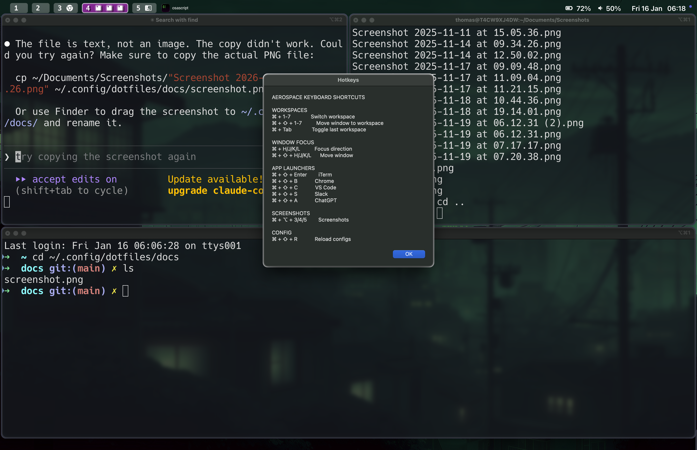

# macOS Tiling Window Manager Dotfiles

A snappy, Hyprland-inspired tiling window manager setup for macOS using Aerospace, Sketchybar, and JankyBorders. Optimized for performance and keyboard-driven workflows.



## What's Included

| Tool | Purpose |
|------|---------|
| [Aerospace](https://github.com/nikitabobko/AeroSpace) | i3-like tiling window manager |
| [Sketchybar](https://github.com/FelixKratz/SketchyBar) | Customizable status bar with workspace icons |
| [JankyBorders](https://github.com/FelixKratz/JankyBorders) | Window borders for visual focus |
| [Ghostty](https://ghostty.org/) | Fast terminal emulator |
| [Starship](https://starship.rs/) | Cross-shell prompt (Pastel Powerline preset) |
| Zsh + Tmux | Shell and terminal multiplexing |
| Neovim + LazyVim | Code editing |

## Keyboard Shortcuts

### Workspace Navigation
| Shortcut | Action |
|----------|--------|
| `Cmd + 1-7` | Switch to workspace 1-7 |
| `Cmd + Tab` | Toggle last workspace |
| `Cmd + Shift + Tab` | Move workspace to next monitor |

### Window Management
| Shortcut | Action |
|----------|--------|
| `Cmd + Shift + 1-7` | Move window to workspace 1-7 |
| `Cmd + H/J/K/L` | Focus window left/down/up/right |
| `Cmd + Shift + H/J/K/L` | Move window left/down/up/right |
| `Cmd + +/-` | Resize window |

### Quick Reference
| Shortcut | Action |
|----------|--------|
| `Cmd + K` | Show all keyboard shortcuts |

### App Launchers
| Shortcut | Action |
|----------|--------|
| `Cmd + Shift + Enter` | New iTerm window |
| `Cmd + Shift + B` | New Chrome window |
| `Cmd + Shift + C` | New VS Code window |
| `Cmd + Shift + S` | Open Slack |
| `Cmd + Shift + A` | Open ChatGPT |

### Screenshots (remapped to avoid workspace conflicts)
| Shortcut | Action |
|----------|--------|
| `Cmd + Alt + 3` | Screenshot entire screen to clipboard |
| `Cmd + Alt + 4` | Selection screenshot to clipboard |
| `Cmd + Alt + 5` | Interactive screenshot mode |

### Config Management
| Shortcut | Action |
|----------|--------|
| `Cmd + Shift + R` | Reload Aerospace + Sketchybar + Borders |
| `Cmd + Shift + ;` | Enter service mode (then `r` to reset layout, `f` to toggle float) |

## Performance Optimizations

This setup includes several optimizations for snappy workspace switching:

### 1. Async Icon Updates
The sketchybar workspace icons update in the background, so they don't block workspace transitions:
```toml
# In aerospace.toml
exec-on-workspace-change = [
    '/bin/bash', '-c',
    'sketchybar --trigger ... ; ~/.config/sketchybar/plugins/update_workspace_icons.sh &',
]
```

### 2. Targeted Workspace Updates
Instead of scanning all workspaces on every change, only the current and previous workspace are updated:
```bash
# In update_workspace_icons.sh
if [ -n "$AEROSPACE_FOCUSED_WORKSPACE" ]; then
    update_space_icons "$AEROSPACE_FOCUSED_WORKSPACE"
fi
if [ -n "$AEROSPACE_PREV_WORKSPACE" ]; then
    update_space_icons "$AEROSPACE_PREV_WORKSPACE"
fi
```

### 3. Sourced Icon Mapping
The icon map function is sourced once instead of spawning a subprocess per app:
```bash
source "$CONFIG_DIR/plugins/icon_map_fn.sh"
icon_map "$app"  # Sets icon_result variable directly
```

### 4. Fast App Launching
App shortcuts use `open -na` instead of slow AppleScript:
```toml
# Fast
cmd-shift-enter = 'exec-and-forget open -na iTerm'

# Slow (avoided)
# cmd-shift-enter = '''exec-and-forget osascript -e 'tell application "iTerm"...'
```

## macOS Settings for Best Performance

### Required
Disable **System Settings > Desktop & Dock > Displays have separate Spaces** (requires logout)

This is critical for fast window detection with Aerospace.

### Recommended
Speed up window animations:
```bash
defaults write -g NSWindowResizeTime -float 0.001
defaults write NSGlobalDomain NSAutomaticWindowAnimationsEnabled -bool false
```

### Required: Disable macOS Screenshot Shortcuts
To free `Cmd+Shift+3/4/5` for workspace management (like Omarchy), you **must** disable macOS screenshot shortcuts via the GUI:

1. Open **System Settings**
2. Go to **Keyboard → Keyboard Shortcuts**
3. Click **Screenshots** in the left sidebar
4. **Uncheck ALL** screenshot shortcuts

> **Note:** Terminal commands (`defaults write`) for this are unreliable. The GUI method works immediately and persists across reboots.

Alternative screenshot shortcuts are configured in aerospace.toml:
- `Cmd + Alt + 3` → Screenshot entire screen
- `Cmd + Alt + 4` → Screenshot selection
- `Cmd + Alt + 5` → Interactive screenshot

## Installation

### Prerequisites
- macOS
- [Homebrew](https://brew.sh/)
- Git

### Install
```bash
git clone https://github.com/thomasht86/dotfiles ~/.config/dotfiles
cd ~/.config/dotfiles
./install.sh              # Core tools, shell, editor
./install_sketchybar.sh   # Status bar
./install_aerospace.sh    # Window manager
```

### Manual Steps After Install
1. Disable "Displays have separate Spaces" in System Settings
2. Log out and back in
3. Run the animation/screenshot defaults commands above

## File Structure

```
~/.config/dotfiles/
├── aerospace/
│   └── aerospace.toml       # Window manager config (symlinked to ~/.config/aerospace/)
├── sketchybar/
│   ├── sketchybarrc         # Status bar config
│   └── plugins/
│       ├── update_workspace_icons.sh  # Optimized icon updater
│       ├── icon_map_fn.sh   # App to icon mapping
│       └── ...
├── borders/
│   └── bordersrc            # Window border config
├── ghostty/
├── starship/
├── tmux/
└── zsh/
```

## Inspiration

- [Omarchy](https://github.com/basecamp/omarchy) - Hyprland-based Linux setup from Basecamp
- [Hyprland](https://hyprland.org/) - The Wayland compositor this setup emulates

## Credits

Originally forked from [mehd-io/dotfiles](https://github.com/mehd-io/dotfiles), heavily modified for performance.
